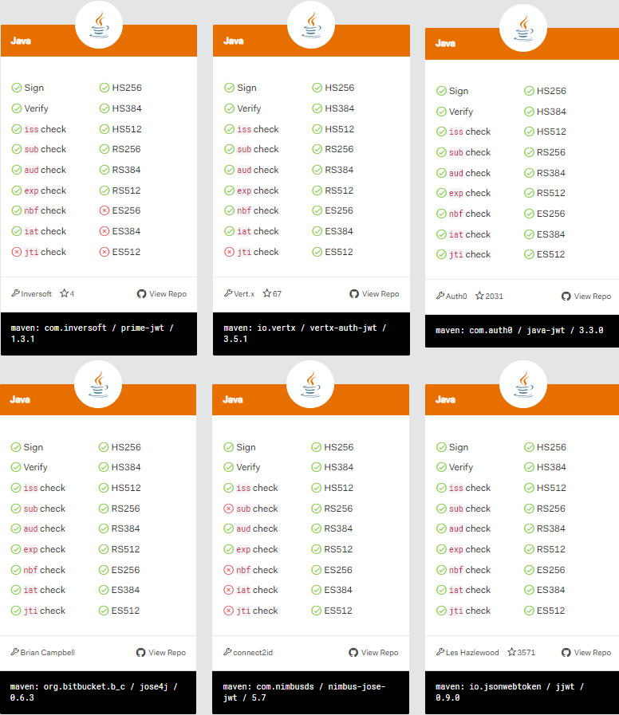

# JWT 정리
## 목차

- [JWT란](#JWT란)
- [lib](#lib)
- [참조](#참조)

---

## JWT란

- ### JWT란
        JWT(JSON Web Token)
        토큰 기반 인증방식
        권한(Claim)이라고 하는 정보를 디지털 서명을 하고
        나중에 비밀 서명키로 검증하는 도구

- ### JWT 구조
        헤더(Header).페이로드(Payload).시그니처(signature)

    - #### 헤더
            해당 토큰이 어떤 암호화 알고리즘을 통해 암호화 되었는지 정의
            "alg" 라는 세부 필드에 알고리즘 종류를 저장

    - #### 페이로드
            실제 전달하고자 하는 메세지 Body를 나타낸다.
            권한(Claim)을 담고있다.
                - iss(Issuer) : 누가 발행 했는지
                - sub(Subject) : 사용자가 누구인지와 사용자 리소스에 대한 URI
                - aud(Audience) : 
                - exp : 토큰 만료 시점
                - scope : 이 토큰으로 이 사용자가 무엇에 접근할 수 있는가(권한)
                

    - #### 시그니처
            전달된 메세지에 대한 검증값(Signature Hash)을 나타낸다.
            상호 합의된 키 값을 가지고 헤더에 정의되어진 알고리즘을 통하여 검증

- ### JWT 규격
        JWT는 권한(Claims) 집합을 JWS와 (또는) JWE 구조로 인코드한 JSON 객체로 표현된다
        기술적으로 JWT는 서명되지 않은 토큰을 의미하지만
        일반적인 상황에서의 JWT는 JWS나 JWS+JWE를 의미한다.

    - #### JWS(JSOn Web Signature)
            서버는 JWT를 JWS 체계로 서명해서 시그니처(Signature)와 함께 클라이언트로 전송
            시그니처는 JWT에 포함된 권한(claim)이 위조되었거나 변경되지 않았다는 것을 보장
            즉, JWS를 통해 위변조를 확인할수 있을 뿐 JWT는 근본적으로 암호화 되지않은 문자열(plaintext)
            따라서 JWT에 민감한 정보를 저장해서는 안됨

    - #### JWE(JSON Web Encryption)
            JWE 체계 에서는 내용이 서명 없이 암호화 됨
            JWT에 암호화를 통한 기밀성을 부여하지만 JWE를 JWS로 서명해서 담는 만큼의 보안성을 제공하지는 못함
            즉, JWS+JWE를 통한 안전한 토큰 생성

- ### 토큰 모범 사례
        - JWT는 안전한 HttpOnly 쿠키에 저장해야 XSS공격을 방지할수 있음
        - 쿠키를 사용해서 JWT를 전송한다면 CSRF 방어가 무엇보다 중요
        - 토큰을 사용하여 사용자를 인증할 때마다 항상 보안키로 사명되어 있는지 검사
        - 리플레이 공격에 대비하려면 nonce(jti)와 유효기간(exp) 생성시간을 권한에 포함시켜야 한다.

---

## lib
- ### java jwt lib별 스펙

---

## 참조
- [JWT 디버거 및 lib](https://jwt.io)
- [JWT doc](https://tools.ietf.org/html/rfc7519#section-4.1)